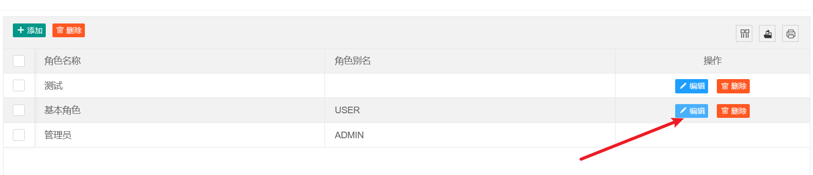
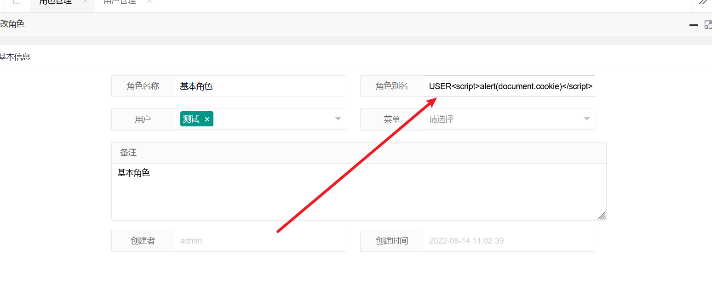
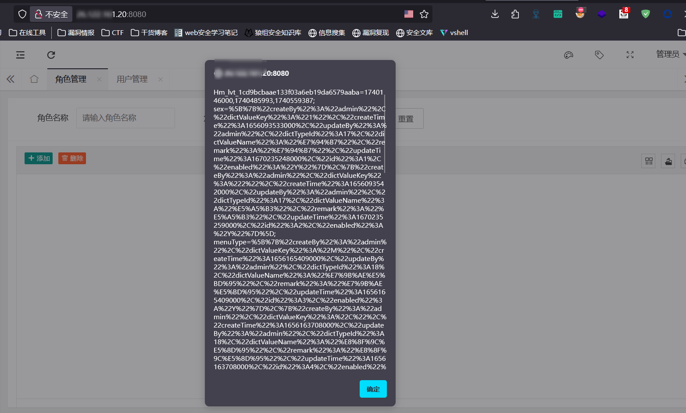

Source code address:https://gitee.com/yangyouwang/crud

Enter the default account and password to log in to the admin 123456 background

Go to the role management function point

Edit the role

Insert the payload of XSS into the character alias  

After saving, the cookie information is successfully popped up to form a storage XSS

